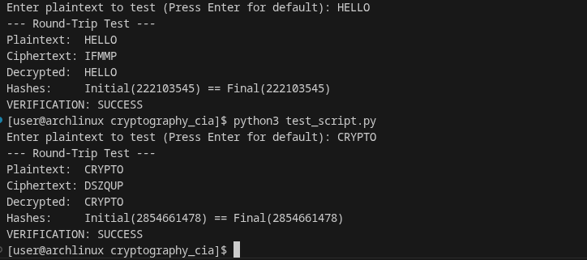

# August Cipher & Custom Hashing Implementation

### 1. August Cipher Theory
The August Cipher is a monoalphabetical substitution cipher it is basically caesar cipher with shift one.
* **Encryption:** Each letter is replaced by the letter following it in the alphabet (A -> B, Z -> A). E(x) = ( x + 1 ) % 26 
* **Decryption:** Each letter is shifted back by one position (B -> A). E(x) = ( x - 1 ) % 26 

### 2. Custom Hash Function: DJB2
For the hashing requirement, I implemented the **DJB2 algorithm** from scratch.
* **Justification:** I chose DJB2 because it is a highly efficient non-cryptographic hash that relies on bitwise operations rather than built-in libraries. 
* **Uniqueness:** I used a custom prime constant (e.g., 5381) to ensure the hash output is unique to this implementation.

### 3. Instructions
Run the test script to verify the round-trip:
`python test_script.py`

### 4. Prompts:
Prompt 1: Can you explain the august cipher is that the one that seems like a fork of the caesar cipher??

Prompt 2: the definition of the August Cipher from my course/notes differs from yours, you are giving a polyalphabetic cipher while the august cipher i remember is a simple substituition cipher that has shift 1 on caesar cipher

Prompt 3: Could you clarify the purpose or role of the hashing function in this context? since the cipher already handles encryption and decryption, why is the  the hash factor needed in the process?

Prompt 4: Exploring Alternative Scenarios"For my understanding, if we were implementing a polyalphabetic cipher instead, would the fundamental relevance or purpose of the hash function change?"

Prompt 5: Please explain the round trip verification flow in like more detail. How exactly does the hash matching process work are hashing the cipher text or plain text? and which specific hashes are being compared during verification?"

Prompt 6: Okay so flow of algorithm is plaintext -> store hash -> encrypt plaintext -> decrypt ciphertext -> decrypted text hash calculated -> compare with stored hash -> hash matched -> verified. Is this correct??

Prompt 7: recommend me a highly efficient straightforward hash function that can be implemented from scratch with ease and remember no library dependencies are allow i.e you cant import libraries and also provide a concise, solid justification for this choice that I can include in my README documentation.

Prompt 8: Why did you choose the DJB2 algorithm the optimal choice for this specific problem statement? I need an explanation that clearly justifies this so i can explain if i am questioned about it.

Prompt : Good. Can you show me the code implementation in python for this??

### 4. Worked Examples

**Example 1:**
- Plaintext: HELLO
- Key: Shift 1
- Ciphertext: IFMMP
- Hash: 222103545

**Example 2:**
- Plaintext: CRYPTO
- Key: Shift 1
- Ciphertext: DSZQUP
- Hash: 2854661478
